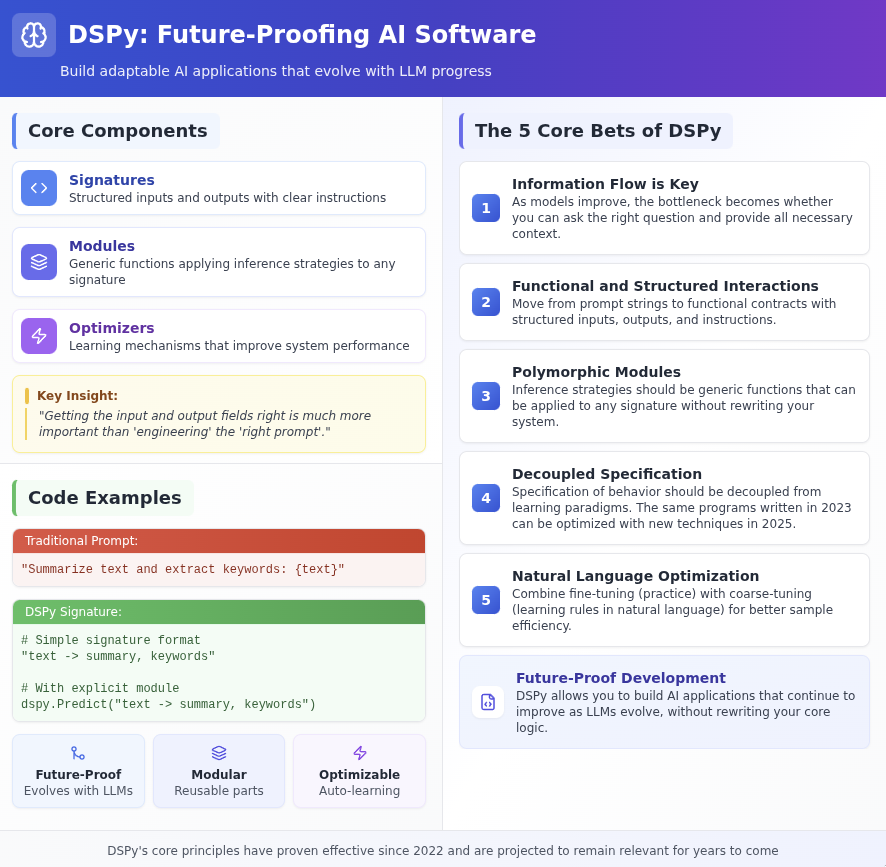

Links
- [DSPy Documentation](https://dspy.ai/#__tabbed_1_4)


Double Saved to `obsidian-llm-tool-use` Github repo and my personal note vault in obsidian via:
```bash
jupytext --to markdown dspy_modules/intro_to_dspy.ipynb -o ~/Obsidian/Notes\ Vault/intro_to_dspy.md
```




First, import the package and setup your llm calling configuration. For this, we'll be using ollama.

Make sure to spin up your ollama server using
```bash
ollama start
```


```python
import importlib.metadata
print(importlib.metadata.version('dspy'))
```


```python
import dspy
lm = dspy.LM('openai/qwen2.5:7b-instruct-q4_K_M', 
             api_base='http://localhost:11434/v1', 
             api_key='', 
             cache=False)

dspy.configure(lm=lm)
dspy.enable_logging()
```

Lets do the basic prompt-response: just use the `lm` as a function!


```python
lm("Say this is a test!", temperature=0.7)  # => ['This is a test!']
```

Super compact syntax.

You could just use this as a nice way to make your LLM calls a bit more pythonic.

You can also send using the chat completions formatting.


```python
lm(messages=[{"role": "user", "content": "Say this is a test!"}])  # => ['This is a test!']
```

Ok now to the first main topic:

## Modules

Modules help you describe AI behavior as *code*. not *strings*.

You specify a *Signature*: a string that defines an action via inputs and outputs behavior: `"question -> answer: float"`

Then you select a *Module* to assign a strategy for invoking the LLM. `Predict` is the simplest one.


```python
solve_math = dspy.Predict("question -> answer: float")
result = solve_math(question="What is 1 + 1?")
print(result.completions)


```

A Module:
- wraps a signature.
- is callable
- carries "learnable parameters" that DSPy can run optimization on.
- composes: modules call other modules, can be stored as `json`, or be nested inside larger `dspy.Program` graphs.
- persists: `module.save()`/`load()` for controlling state.


There's a few really powerful primative ones already implemented, like `dspy.ChainOfThought`. It automatically:
1. Inserts an instruction telling the LLM to show its reasoning.
2. Adds an implicit extra output field called `reasoning`.
3. Returns both the reasoning and the final answer, while still respecting the original signature.

So that's why it won't be very good for:


```python
result = solve_math(question="What is the third root of 963261?")
print(result.completions)
```

But you can get pretty creative with the signatures.  LLM act as this universal function approximator written via English.  Modules try to shape that approximator into a math function.


```python
solve_riddle = dspy.Predict("riddle -> answer")
print(solve_riddle(riddle="What has keys but can't open locks?").answer)
```

In your *Signature* you can list multiple fields: `"context: list[str], question -> answer"` or omit the types if they're strings.


```python
emojify = dspy.Predict("story -> emoji_sequence")

story="""You're walking in the woods
There's no one around and your phone is dead
Out of the corner of your eye you spot him
Shia LaBeouf

He's following you, about 30 feet back
He gets down on all fours and breaks into a sprint
He's gaining on you
Shia LaBeouf

You're looking for you car but you're all turned around
He's almost upon you now
And you can see there's blood on his face
My God, there's blood everywhere!

Running for you life (from Shia LaBeouf)
He's brandishing a knife (it's Shia LaBeouf)
Lurking in the shadows
Hollywood superstar Shia LaBeouf

Living in the woods (Shia LaBeouf)
Killing for sport (Shia LaBeouf)
Eating all the bodies
Actual cannibal Shia LaBeouf"""

emoji_sequence = emojify(story=story)
print(emoji_sequence.emoji_sequence)
```


```python
translate = dspy.Predict("string -> italian")
translation = translate(string=story)
print(translation.italian)
```

### Single-shot predictors

There's `Predict`, `ChainOfThought`, and `ChainOfThoughtWithHint` as well.


```python
find_time_complexity = dspy.ChainOfThought("function -> time_complexity")

def fibonacci(n):
    if n <= 1:
        return n
    else:
        return fibonacci(n-1) + fibonacci(n-2)
    
complexity = find_time_complexity(function=fibonacci)
print(complexity.completions)
```


```python
cot_hint = dspy.ChainOfThoughtWithHint("question -> answer: float")
prediction = cot_hint(question="What is 16 x 17?", hint="16x10=160 and 16x7=112")  
print(prediction.reasoning)
print("----")
print(prediction.answer)
```

### Multi-shot Predictors

Some built-in Modules use multiple LLM calls and tools to iteratively improve responses.

`ReAct`: implements a *ReAct* agent pattern: the LLM alternates between thinking and calling user-supplied tooks, and stops when it fills the Signature. Used for search-and-answer agents, code-execution helpers, custom tool use.


```python
# ReAct tool counts number of letter occurances in a string
def count_letters(string: str) -> dict:
    counts = {}
    for letter in string:
        if letter.isalpha():
            counts[letter] = counts.get(letter, 0) + 1
    return counts

question_answerer = dspy.ReAct("question -> answer",tools=[count_letters],max_iters=3)

print(question_answerer(question="How many R's in the word strawberry?"))
```

`ProgramOfThought`: ask LLM to write a python program, executes it, then passes result back into the answer. 

It relies on `Deno`, a code runtime for lightweight scripts, which needs to be installed using:

```bash
brew install deno
```


```python
from dspy import PythonInterpreter

#test that the Python interpreter works
print(PythonInterpreter()("print('Hello World!')"))
```


```python

pot = dspy.ProgramOfThought("question -> answer: float", max_iters=5)

code_gen = pot.code_generate(question="what is 5234 times 5324?")
#adding `.code_generate` to the end makes that the code doesn't execute. it just generates and returns the code.
print(code_gen,"="*15)


result = pot(question="what is 5234 times 5324?")
result
```


```python
result_2 = pot(question="what is 5234 times 5324?")
result_2
```


```python
pot_math = dspy.ProgramOfThought("question -> answer: float", max_iters=5).code_generate
result = pot_math(question="What is the  third root of 963261?")
result
```


```python
code_attempt = pot_math(question="what is the eigth root of 52876533252")  # raw string
print(code_attempt)
```


```python
dspy.inspect_history(n=5)
```

`MultiChainComparison`: Spins up `M` separate `ChainOfThought` traces, asks the LLM to vote-critique, and returns the best. Fastest way to logarithmically scale intelligence.

### Your Own Modules and Signatures

Starting from the built-in ones, you can construct your own modules that include multiple LLM calls and complicated flows.

Custom signatures work similarly. You can define multiple `InputField()` and `OutputField()`'s.


```python
#first, we'll tell it our birthday
#and it figures out our sign
class ZodiacSignature(dspy.Signature):
    birth_day = dspy.InputField()
    sign= dspy.OutputField(desc="Aries, Taurus, …, Pisces")


#then it creates a horoscope.
class HoroscopeSignature(dspy.Signature):
    sign= dspy.InputField(desc='Zodiac sign')
    current_date= dspy.InputField(desc='In YYYY-MM-DD format')
    horoscope= dspy.OutputField(desc="One-paragraph horoscope")
    lucky_numbers= dspy.OutputField(desc="Comma-separated lucky numbers")

```


```python
from datetime import date


class HoroscopeFromBirthday(dspy.Module):
    def __init__(self):
        super().__init__()
        self.predict_sign = dspy.Predict(ZodiacSignature)
        self.create_horoscope=dspy.ChainOfThought(HoroscopeSignature)

    def forward(self, birth_day:str):
        #get the zodiac sign
        sign_pred = self.predict_sign(birth_day=birth_day)
        sign = sign_pred.sign
        #create the horoscope
        today = date.today()
        horo_pred = self.create_horoscope(sign=sign,current_date=today)


        #Prediction acts as the return type. A dictionary wrapper
        return dspy.Prediction(
            sign = sign,
            horoscope_reasoning = horo_pred.reasoning,
            horoscope = horo_pred.horoscope,
            lucky_numbers = horo_pred.lucky_numbers
        )


zodiac_finder=HoroscopeFromBirthday()
text = "I was born on december 25, 2000"
print('Input:', text)
print(zodiac_finder(birth_day=text))
        
```

## Complex Module Example: Story Lab

You give it a story scenario/genre and it will work through the idea:
- first, it calls `FindInspo`, which comes up with a few catchy ideas.
- then it drafts the 


```python
class FindInspo(dspy.Signature):
    topic   = dspy.InputField()
    blurbs  = dspy.OutputField(format=list, desc="3-5 catchy micro-blurbs")

class DraftPlot(dspy.Signature):
    topic   = dspy.InputField()
    blurbs  = dspy.InputField(format=list)
    outline = dspy.OutputField(desc="bullet outline of the plot")

class BuildQuiz(dspy.Signature):
    story      = dspy.InputField()
    questions  = dspy.OutputField(
        format=list,
        desc="list of (Q, choices:list, correct:str) tuples")

class TeaseTweet(dspy.Signature):
    story = dspy.InputField()
    tweet = dspy.OutputField(desc="≤280-char teaser")


# ── 2. Custom module (3 distinct DSPy modules) ───────────────────
class StoryPuzzleLab(dspy.Module):
    """
    Modules used →
      ① ChainOfThought         – inspirations & quiz
      ② ChainOfThoughtWithHint – plot expansion
      ③ ProgramOfThought       – code-driven puzzle generation
    """

    def __init__(self):
        super().__init__()
        self.inspirer = dspy.ChainOfThought(FindInspo, n=1)
        self.plotter  = dspy.ChainOfThoughtWithHint(DraftPlot)
        self.quizzer  = dspy.ChainOfThought(BuildQuiz)
        self.teaser   = dspy.ChainOfThought(TeaseTweet, max_len=70)  # ≈ tweet

    def forward(self, topic: str):
        blurbs   = self.inspirer(topic=topic).blurbs
        outline  = self.plotter(topic=topic, blurbs=blurbs).outline
        quiz     = self.quizzer(story=outline).questions
        tweet    = self.teaser(story=outline).tweet

        return dict(outline=outline, quiz=quiz, tweet=tweet, inspo=blurbs)


lab = StoryPuzzleLab()
res = lab("Lost temple, steam-age explorers")
print("\n— INSPIRATION —\n", res["inspo"])
print("\n— STORY —\n",res["outline"])
print("\n— QUIZ —\n",res['quiz'])
print("\n— TWEET —\n", res["tweet"])
```


```python

```


```python
type(res['quiz'])
```

## So What?: Optimizers

The syntax is nice and simple and whatever but what's so special about DSPy?

Well notice how we haven't really defined individual *prompts*? Instead we've been defining Signatures that convey some amount of prompt information. On the backend, Signatures are parsed and converted into one of many basic boilerplate prompts.  *Optimizers* act as ways to iteratively improved those boiletplate prompts.  

You define a metric associated with the Module you've constructed, you run a couple data samples through the system, then the Optimizer comes in and tweaks the prompts based on the failure modes it's picked up on.  

There's a ton of different Optimizers out there that each try to modify the prompts in different ways:
- `BootstrapFewShot` creates few-shot demonstrations
- `MIPROv2` and `COPRO` use Bayesian search to propose better natural language instruction. 
- `BootstrapFinetune` can be used with smaller LLMs to distill the prompts into weight updates

Each Optimizer accepts two arguments: 
- a `Module`
- a metric function that returns a float
- train/validation data: 10-300 `Examples`


This example is for sentiment analysis, a pretty mundane task nowadays, but there's tons of available data for it.  For data we're using the Stanford Sentiment Treebank, a collection of single sentence rotton tomatoes reviews that are labelled as either positive or negative. 


```python
from dspy.teleprompt import BootstrapFewShot
from datasets import load_dataset


#construct module
sentiment = dspy.Predict("text -> label")

ds = load_dataset("sst2", split="train[:20]")
print("Example")
print(ds[6])


trainset = [
    dspy.Example(text=ex["sentence"],
                 label="positive" if ex["label"] else "negative").with_inputs("text")
    for ex in ds
]

```

    Example
    {'idx': 6, 'sentence': 'demonstrates that the director of such hollywood blockbusters as patriot games can still turn out a small , personal film with an emotional wallop . ', 'label': 1}


Next we have to define our metric function, which captures some sort of validation on the task we're trying to complete. In this case it's pretty trivial: does the Module return the correct label?


```python
def em(example, pred, *_, **__):
    return int(example.label == pred.label)
```

For our first round of optimizations we're using BootstrapFewShot. This optimizer adds `k` fewshot examples to the prompt.  Essentially it automates the process of picking the examples that work the best.


For tasks with small token counts you can set the number of examples pretty high. For high token count things that gets a little trickier.


```python
opt = BootstrapFewShot(metric=em,
                       max_labeled_demos=4,
                       max_bootstrapped_demos=4)
sentiment_clf = opt.compile(sentiment, trainset=trainset)


print(sentiment_clf(text="It was a delightful movie!").label)
```

     25%|██▌       | 5/20 [00:05<00:17,  1.20s/it]


    Bootstrapped 4 full traces after 5 examples for up to 1 rounds, amounting to 5 attempts.
    positive


Optimizers can be saved to json using `save()` and autologged to MLFlow.


```python
sentiment_clf.save("./sentiment.json", save_program=False)

```

## Different Optimizer Methods

## Going Larger: Programs

## Logging LLM calls for debugging

## 

# Appendix

### Bayesian Search
Also called Bayesian optimization. It's a strategy for searching through a large parameter-space with only a small amount of traversals are allowed.  It tries to balance exploration with exploitation

1. Start with some given prior.
2. Try a few prompts and record their scores
3. Fit a surrogate model: try to cheaply model the relationship between instruction -> expected score.
4. Use the surrogate to identify potential new instruction candidates.
5. Evaluate, update surrogate, repeat.

It's basically a cheap and dirty way to get something functioning.


